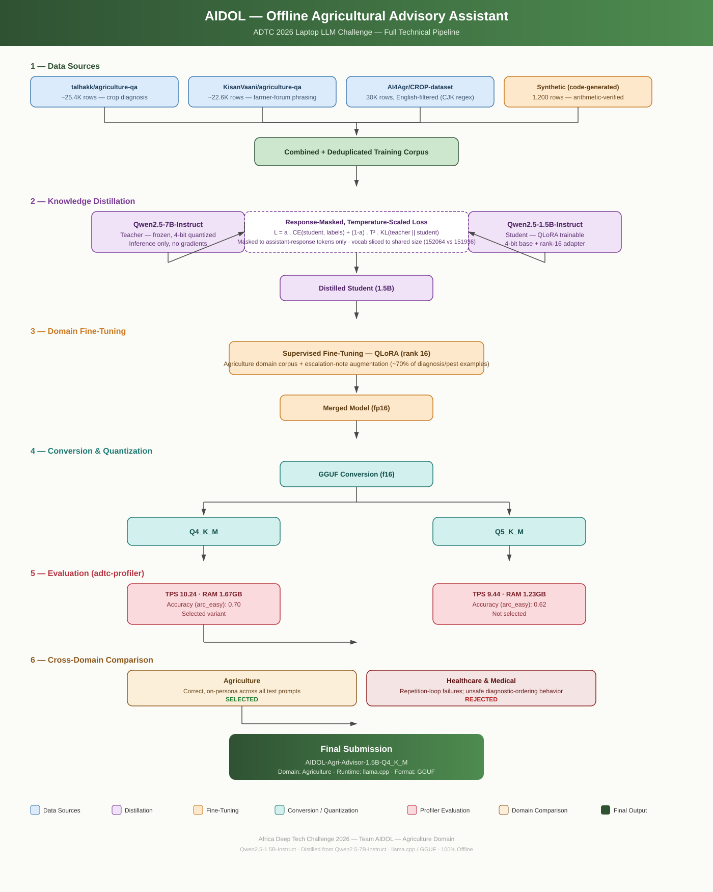

# AIDOL — Offline Agricultural Advisory Assistant


-4B0082)


**Team:** AIDOL &nbsp;·&nbsp; **Submitter:** Adegoke Israel Adedolapo &nbsp;·&nbsp; **Domain:** Agriculture &nbsp;·&nbsp; **Challenge:** Africa Deep Tech Challenge 2026 — The Laptop LLM Challenge

An offline, single-turn agricultural advisory assistant covering crop diagnosis, fertilizer/input calculation, pest management, and market economics — built to run entirely on an 8GB commodity laptop with **zero cloud dependency**, for smallholder farmers and extension officers who cannot rely on stable connectivity.

---

## Architecture



The model was produced through a two-stage training pipeline — knowledge distillation from a larger teacher model, followed by domain-specific fine-tuning — then converted to GGUF and quantized for offline CPU inference via llama.cpp. Two candidate domains (Agriculture and Healthcare & Medical) were built and evaluated through this identical pipeline before Agriculture was selected as the final submission; see [`REPORT.md`](REPORT.md) for the full technical writeup.

---

## Repository Structure

```
.
├── metadata.json          # Submission metadata (team, domain, model info, test prompts)
├── download_model.sh      # Downloads the quantized GGUF model — no credentials required
├── REPORT.md              # Full technical report: problem, design decisions, benchmarks
├── images/
│   └── pipeline_architecture.svg   # Full pipeline architecture diagram
├── model/                 # Populated by download_model.sh — not committed to git
└── .gitignore
```

---

## Quick Start

```bash
# 1. Download the model (public — no Hugging Face token required)
bash download_model.sh

# 2. Validate with the official ADTC profiler
adtc-profiler run --submission . --mode participant --output submission.json --skip-accuracy
```

A valid run reports `"measured_on": "participant_laptop"` in the output.

---

## Why Agriculture

Agriculture and Healthcare & Medical were each built to equivalent depth and compared directly before a final domain was chosen. Agriculture's outputs were consistently correct and on-persona across every test prompt and both quantization levels evaluated. The healthcare candidate, despite competitive automated benchmark scores, showed real safety-relevant failures under direct generation testing — including degenerate repetition and, in one case, recommending an invasive diagnostic procedure in direct violation of its own "not a diagnostic tool" system instruction. Full comparison in [`REPORT.md`](REPORT.md#domain-selection).

## Why This Model

**Qwen2.5-1.5B-Instruct** was selected as the base model for its instruction-following quality relative to size, Apache 2.0 licensing, mature GGUF conversion support, and a resource footprint that leaves substantial headroom under the competition's 7GB memory budget.

## Why Distillation

A direct supervised fine-tuning baseline was trained first to establish whether distillation would justify its added engineering cost. Based on that result, a distillation stage — Qwen2.5-7B-Instruct as a frozen 4-bit teacher, response-masked and temperature-scaled CE + KL divergence loss — was added prior to domain fine-tuning, to transfer general reasoning quality into the 1.5B student before narrowing it to the agriculture domain.

## Why This Quantization

Q4_K_M and Q5_K_M were both built and profiled on real hardware measurements. Q4_K_M was selected: higher measured accuracy (0.70 vs. 0.62 on the local `arc_easy` smoke test) and higher throughput (10.24 vs. 9.44 tokens/sec), with both variants comfortably within the 7GB memory budget.

---

## Benchmarks (measured)

| Metric | Value |
|---|---|
| Tokens/sec (generation) | 10.24 |
| Peak RAM | 1.67 GB |
| Accuracy (`arc_easy`, 50-sample smoke test) | 0.70 |
| Thermal throttling | Not detected |

Full benchmark methodology and results in [`REPORT.md`](REPORT.md#benchmarks).

---

## License

Apache 2.0, consistent with the base model license.
